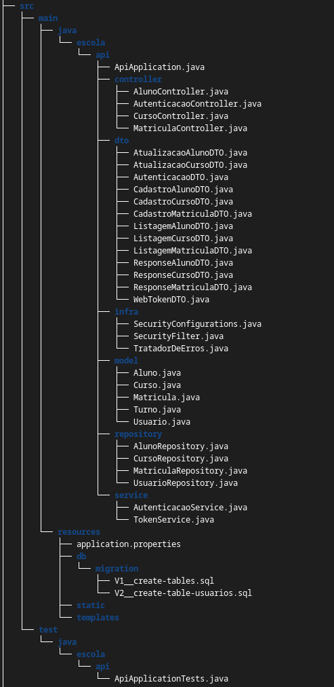

# Matrícula de Cursos API

### Descrição

A Matrícula de Cursos API é uma aplicação desenvolvida com Spring Boot que permite a criação, gerenciamento e consulta de cursos em uma escola. A API fornece endpoints RESTful para realizar operações como cadastrar novos cursos e alunos, listar todos os cursos e alunos, atualizar informações e excluir cursos e alunos, garantindo uma interface eficiente e fácil de usar para o gerenciamento de matrículas.

## Funcionalidades principais

- **endpoints de cursos** com métodos POST, GET, PUT e DELETE
- **endpoints de alunos** com métodos POST, GET, PUT e DELETE
- **endpoints de matrículas** com métodos POST, GET e DELETE

As matriculas são geradas a partir de um relacionamento de n para n, com cardinalidade mínima de zero em ambos os lados, entre as entidades curso e aluno.

## Tecnologias Utilizadas

- Spring Boot 3
- Java 17
- Lombok
- MySQL/ Flyway
- JPA/Hibernate
- Maven
- Insomnia
- Security
- Auth0/ jwt

## Estrutura do Projeto

